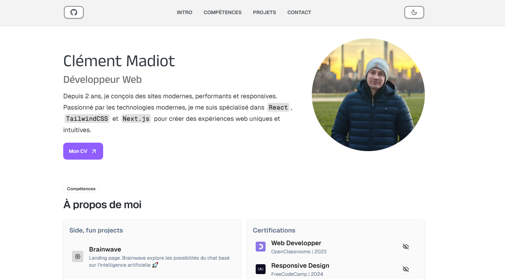

<div align="center">
  <a href="https://cmadiot.netlify.app/" target="_blanck"></a>
   <div align="center">
      
      
      
    </div>
  <h3 align="center">Portfolio | Clément</h3>
</div>

## <br /> 📋 <a name="table">Summary</a>

- ✨ [Introduction](#introduction)
- 🛠 [Technology Used](#tech-stack)
- 📝 [Features](#features)
- 🚀 [Launch App](#launch-app)
- 🎨 [Styling](#style)

## <br /> <a name="introduction">✨ Introduction</a>

**[ENG]** This Nextjs-based portfolio showcases my projects with a modern and responsive design powered by TailwindCSS and enhanced by Framer Motion for sleek animations. Features include a project filter, pop-up modals for detailed previews. 

It integrates React Icons, Lucide-react, and Geist for a polished UI, while tools like tailwind-merge, clsx, and scroll-lock ensure optimized styling and user experience. Built with performance and accessibility in mind, it offers a smooth and engaging way to explore your work.

**[FR]** Ce portfolio développé avec NextJS présente mes projets avec un design moderne et responsive grâce à TailwindCSS, et des animations fluides via Framer Motion. Il propose un système de filtre, des modales interactives pour afficher les projets en détail. 

L’interface soignée repose sur React Icons, Lucide-react et la police Geist, tandis que tailwind-merge, clsx et scroll-lock optimisent le style et l’expérience utilisateur. Conçu pour la performance et l’accessibilité, ce portfolio offre une navigation fluide et immersive.

## <br /> <a name="tech-stack">🛠 Technology Used</a>

- [TailwindCSS](https://tailwindcss.com/docs/installation)
  Tailwind CSS is a valuable tool for developers who want to build modern, responsive, and visually appealing websites without sacrificing development speed.

- [tailwindcss-animated](https://www.npmjs.com/package/tailwindcss-animated)
  Extended animation utilities for Tailwind CSS

- [tailwind-merge](https://www.npmjs.com/package/tailwind-merge)
Utility function to efficiently merge Tailwind CSS classes in JS without style conflicts.

- [framer-motion](https://www.npmjs.com/package/framer-motion)
  Framer Motion is an open source, production-ready library that’s designed for all creative developers.

- [clsx](https://www.npmjs.com/package/clsx)
  It's a tiny (229B) utility for constructing className strings conditionally.

- [react-icon](https://www.npmjs.com/package/react-icons)
  Include popular icons in your React projects easily with react-icons, which utilizes ES6 imports that allows you to include only the icons that your project is using.

- [Lucide-react](https://www.npmjs.com/package/lucide-react)
  Library of open-source icons designed for React applications. Provides a collection of customizable, pixel-perfect icons that can be easily integrated into React projects.

- [scroll-lock](https://www.npmjs.com/package/scroll-lock)
  Cross-browser JavaScript library to disable scrolling page

- [Geist](https://www.npmjs.com/package/geist)
  Geist is a new font family created by Vercel in collaboration with Basement Studio.

## <a name="features">📝 Features</a>

- **Responsive Design**: The portfolio is designed to be fully responsive, ensuring a seamless experience across devices.

- **Filter**: The portfolio includes a filter feature that allows users to sort projects by category, making it easy to find specific types of work.

- **Pop Up Modal**: Each project can be viewed in detail through a pop-up modal with a short description an technologie used that provide an immersive experience without leaving the main page.

- **Animations**: The portfolio includes smooth animations to enhance user engagement and provide a modern look.

- **Contact Form**: A contact form is available for users to get in touch, with validation to ensure proper input.

- **Social Media Links**: The portfolio includes links to social media profiles, allowing users to connect with the developer.

- **Performance Optimization**: The portfolio is optimized for performance, ensuring fast loading times and a smooth user experience.

- **Accessibility**: The portfolio follows best practices for accessibility, ensuring it is usable by people with disabilities.


## <br /> <a name="launch-app">🚀 Launch App</a>

Follow these steps to set up the project locally on your machine.

**Prerequisites**

> [!NOTE]
> Make sure you have the following installed on your machine:

- [Git](https://git-scm.com/)
- [Node.js](https://nodejs.org/en)
- [npm](https://www.npmjs.com/) _(Node Package Manager)_

**Cloning the Repository**

```bash
git clone {git remote URL}
cd {git project..}
```

**Installation**

> After cloning the repository, run the command `npm i` or `yarn i` to install the project's dependencies.

> Run the development server:

```bash
npm run dev
# or
yarn dev
# or
pnpm dev
# or
bun dev
```

## <br /> <a name="style">🎨 Styling</a>

Global styling are defined using **CSS** & **TailwindCSS**

<details>
<summary><code>global.css</code></summary>

```css
@tailwind base;
@tailwind components;
@tailwind utilities;

@layer base {
  :root {
    --background: 0 0% 100%;
    /* Light mode background */
    --foreground: 210 12% 16%;
    --muted: 0 12% 90%;
    --muted-foreground: 215 20.2% 43%;
    --popover: 0 0% 97%;
    --popover-foreground: 210 12% 6%;
    --card: 0 0% 98%;
    --card-foreground: 210 12% 11%;
    --border: 0 0% 95%;
    --input: 0 0% 92%;
    --primary: 210 13% 21%;
    --primary-foreground: 210 13% 81%;
    --secondary: 210 3% 75%;
    --secondary-foreground: 210 3% 15%;
    --accent: 0 0% 85%;
    --accent-foreground: 0 0% 25%;
    --destructive: 9 92% 38%;
    --destructive-foreground: 0 0% 100%;
    --ring: 210 13% 21%;
    --chart-1: 210 13% 21%;
    --chart-2: 210 3% 95%;
    --chart-3: 0 0% 85%;
    --chart-4: 210 3% 78%;
    --chart-5: 0 0% 98%;
    --progress: 142, 69%, 58%;
    --skillRounded: 210, 13%, 21%, 0.1;
    --techs: 261, 70%, 55%;

  }

  * {
    @apply border-border scroll-smooth;
  }

  body {
    @apply bg-background text-foreground;
  }
}

/* Scrollbar */
* {
  scrollbar-width: thin;
  /* Width of the scrollbar */
  scrollbar-color: var(--primary);
  /* Color of the thumb and track */
}

::-webkit-scrollbar-track {
  background-color: var(--foreground);
  /* Color of the scrollbar track */
}

::-webkit-scrollbar-thumb {
  background-color: var(--primary);
  /* Color of the scrollbar thumb */
  opacity: 0.6;
}

::-webkit-scrollbar-thumb:hover {
  background-color: var(--primary);
  /* Color of the scrollbar thumb */
  opacity: 1;
}


@layer utilities {

  /* START of Typography */
  .base-bold {
    @apply text-[16px] font-bold leading-[24px];
  }

  /* END of Typography */

  /* Image  */
  .bg-outline-filter {
    filter: invert(1) sepia(1) saturate(1) hue-rotate(180deg) !important;
    opacity: 0.2;
  }

  /* START of Button */

  .button {
    @apply !w-5 !h-5;
  }

  .button-small {
    @apply !w-4 !h-4;
  }

  /* END of Button */

  /* START of Common */
  .container {
    @apply mx-auto max-w-[1252px] px-16 max-xl:px-10 max-lg:px-6 max-sm:px-4;
  }

  .caption {
    @apply small-2 mb-5 uppercase text-p3;
  }

  .scroll-hide::-webkit-scrollbar {
    display: none;
  }

  .scroll-hide {
    -ms-overflow-style: none;
    /* IE and Edge */
    scrollbar-width: none;
    /* Firefox */
  }

  /* END of Common */

}
```

</details>

<details>
<summary><code>tailwind.config.js</code></summary>

```cjs
import type { Config } from "tailwindcss";

export default {
  darkMode: ["class"],
  content: [
    "./src/pages/**/*.{js,ts,jsx,tsx,mdx}",
    "./src/components/**/*.{js,ts,jsx,tsx,mdx}",
    "./src/app/**/*.{js,ts,jsx,tsx,mdx}",
  ],
  theme: {
    fontFamily: {
      sans: ["var(--font-geist-sans)"],
      mono: ["var(--font-geist-mono)"],
      caption: ["var(--font-caption)"],
    },
    screens: {
      vsm: "375px",
      sm: "640px",
      md: "768px",
      lg: "1024px",
      xl: "1280px",
    },
    extend: {
      display: ["group-hover"],
      colors: {
        background: "hsl(var(--background))",
        foreground: "hsl(var(--foreground))",
        card: {
          DEFAULT: "hsl(var(--card))",
          foreground: "hsl(var(--card-foreground))",
        },
        popover: {
          DEFAULT: "hsl(var(--popover))",
          foreground: "hsl(var(--popover-foreground))",
        },
        primary: {
          DEFAULT: "hsl(var(--primary))",
          foreground: "hsl(var(--primary-foreground))",
        },
        secondary: {
          DEFAULT: "hsl(var(--secondary))",
          foreground: "hsl(var(--secondary-foreground))",
        },
        muted: {
          DEFAULT: "hsl(var(--muted))",
          foreground: "hsl(var(--muted-foreground))",
        },
        accent: {
          DEFAULT: "hsl(var(--accent))",
          foreground: "hsl(var(--accent-foreground))",
        },
        destructive: {
          DEFAULT: "hsl(var(--destructive))",
          foreground: "hsl(var(--destructive-foreground))",
        },
        border: "hsl(var(--border))",
        input: "hsl(var(--input))",
        ring: "hsl(var(--ring))",
        chart: {
          "1": "hsl(var(--chart-1))",
          "2": "hsl(var(--chart-2))",
          "3": "hsl(var(--chart-3))",
          "4": "hsl(var(--chart-4))",
          "5": "hsl(var(--chart-5))",
        },
        progress: "hsl(var(--progress))",
        skillRounded: "hsl(var(--skillRounded))",
        techs: "hsl(var(--techs))",
      },
      borderRadius: {
        lg: "var(--radius)",
        md: "calc(var(--radius) - 2px)",
        sm: "calc(var(--radius) - 4px)",
      },
      spacing: {
        "1/5": "20%",
        "2/5": "40%",
        "3/5": "60%",
        "4/5": "80%",
        "3/20": "15%",
        "7/20": "35%",
        "9/20": "45%",
        "11/20": "55%",
        "13/20": "65%",
        "15/20": "75%",
        "17/20": "85%",
        "19/20": "95%",
        22: "88px",
        100: "100px",
        512: "512px",
        330: "330px",
        388: "388px",
        400: "400px",
        440: "440px",
        640: "640px",
        960: "960px",
        1230: "1230px",
      },
    },
  },
  plugins: [],
} satisfies Config;

```

</details>
